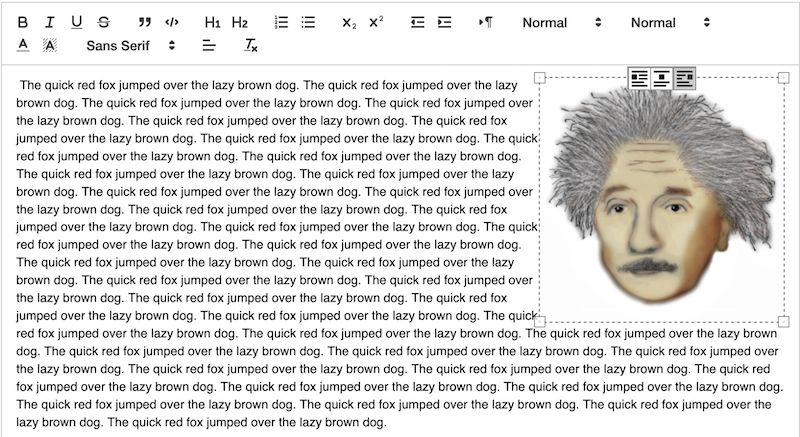

# Quill Image

This is a set of Quill modules, designed to be used together, that fully integrate with the Quill Delta format to provide resizable, floatable images independent from the HTML DOM.



It is a fork and rewrite of [quill-blot-formatter](https://www.npmjs.com/package/quill-blot-formatter) that makes the following improvements:

1. Functionality is decomposed into two packages: `@xeger/quill-image-formats` which extends Quill's built-in `Image` blot with new formats; and `@xeger/quill-image-actions` which contains the UI for applying and removing those formats.
1. Instead of applying `align` (an existing block format) to images, we define a new `float` format which allows text to wrap naturally around images.
1. For the "centered image" case, we reuse Quill's existing support for aligning whole lines of text, with the image being part of the line.
1. The packages have been ported from [Flow](https://flow.org/) to [TypeScript](https://www.typescriptlang.org/).
1. The packages do not statically import the `quill` or `parchment` packages, making them more portable and compatible with a wider range of transpilation environments, including "no transpilation" i.e. direct embedding in an HTML page alongside the Quill distribution bundle.

## Getting Started

**Note:** these packages are pure Node modules and do not have default exports. They are distributed with a CommonJS bundle as well as modular source files (which advanced users can import piecemeal), but the full API is exposed through top-level exports.

### With a Plain HTML Page

In your `head`, load the Quill bundle.

```html
<head>
  <link href="https://cdn.quilljs.com/1.3.7/quill.snow.css" rel="stylesheet">
  <script src="https://cdn.quilljs.com/1.3.7/quill.js"></script>
</head>
```

Then, in a module-type `script` tag, import the extensions.

```html
  <script type="module">
    import { ImageActions } from 'https://cdn.jsdelivr.net/npm/@xeger/quill-image-actions/lib/index.js';
    import { ImageFormats } from 'https://cdn.jsdelivr.net/npm/@xeger/quill-image-formats/lib/index.js';

    // TODO: Register the modules with Quill singleton
    // TODO: Instantiate a Quill instance w/ suitable configuration
```

See [the demo page](assets/demo.html) for a complete, working example.

### With a React Project

Add the dependencies to your project.

```shell
npm install @xeger/quill-image-actions --save-prod
npm install @xeger/quill-image-formats --save-prod
```

At startup, import the extension modules and register them with `react-quill`'s wrapper of the Quill framework.

```typescript
import { Quill } from 'react-quill';
import { ImageActions } from '@xeger/quill-image-actions';
import { ImageFormats } from '@xeger/quill-image-formats';

Quill.register('modules/imageActions', ImageActions);
Quill.register('modules/imageFormats', ImageFormats);
```

Whenever you instantiate a `ReactQuill`, make sure to include the formats and modules in its configuration!

```typescript
import React from 'react';
import ReactQuill from 'react-quill';

const formats = ['align', 'float'];
const modules = {
  imageActions: {},
  imageFormats: {},
  toolbar: [
    [{ 'align': [] }],
    ['clean']
  ]
};

export const Editor(): React.FC = () => (
  <ReactQuill
    formats={formats}
    modules={modules}
    theme="snow"
  />
);
```
