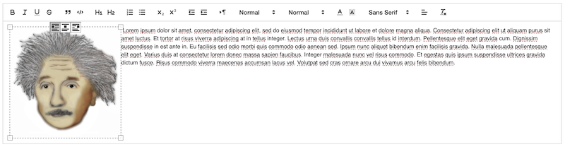

# Quill Image

This repository contains a pair of extensions for the [Quill rich text editor](https://quilljs.com/) that improves the styling of images embedded in the editor and adds an intuitive UI for applying styles.



It is a fork and rewrite of [quill-blot-formatter](https://www.npmjs.com/package/quill-blot-formatter) that varies in the following ways:

1. Functionality is decomposed into two packages: `@xeger/quill-image-formats` which extends Quill's built-in `Image` blot with new formats; and `@xeger/quill-image-actions` which contains the UI for applying and removing those formats.
1. Instead of applying `align` (an existing block format) to images, we define a new `float` format which allows text to wrap naturally around images.
1. For the "centered image" case, we reuse Quill's existing support for aligning whole lines of text, with the image being part of the line.
1. The packages have been ported from [Flow](https://flow.org/) to [TypeScript](https://www.typescriptlang.org/).
1. The packages do not statically import the `quill` or `parchment` packages, making them more portable and compatible with a wider range of transpilation environments, including "no transpilation" i.e. direct embedding in an HTML page alongside the Quill distribution bundle.

## Getting Started

**Note:** these packages are pure Node modules and do not have default exports. They are distributed with a CommonJS bundle as well as modular source files (which advanced users can import piecemeal), but the full API is exposed through top-level exports.

### With a Plain HTML Page

Load the Quill bundle, import the extension modules, register them with the Quill framework, and instantiate an editor. Make sure to include the formats and modules in the editor's configuration!

```html
<!DOCTYPE html>

<html>
  <head>
    <link href="https://cdn.quilljs.com/1.3.7/quill.snow.css" rel="stylesheet">
    <script src="https://cdn.quilljs.com/1.3.7/quill.js"></script>
  </head>
  <body>
    <div id="editor" />
    <script type="module">
      import { ImageActions } from 'TODO';
      import { ImageFormats } from 'TODO';

      Quill.register('modules/imageActions', ImageActions);
      Quill.register('modules/imageFormats', ImageFormats);

      const quill = new Quill('#editor', {
        formats: ['align', 'float'],
        modules: {
          imageActions: {},
          imageFormats: {},
          toolbar: [
            [{ 'align': [] }],
            ['clean']
          ]
        },
        theme: 'snow'
      });

      quill.on('text-change',
        () => console.log(quill.getContents().ops)
      );
    </script>
  </body>
</html>
```

### With a React Project

At startup, import the extension modules and register them with `react-quill`'s wrapper of the Quill framework.

```typescript
import { Quill } from 'react-quill';
import { ImageActions } from '@xeger/quill-image-actions';
import { ImageFormats } from '@xeger/quill-image-formats';

Quill.register('modules/imageActions', ImageActions);
Quill.register('modules/imageFormats', ImageFormats);
```

Whenever you instantiate a `ReactQuill`, make sure to include the formats and modules in its configuration!

```typescript
import React from 'react';
import ReactQuill from 'react-quill';

const formats = ['align', 'float'];
const modules = {
  imageActions: {},
  imageFormats: {},
  toolbar: [
    [{ 'align': [] }],
    ['clean']
  ]
};

export const Editor(): React.FC = () => (
  <ReactQuill
    formats={formats}
    modules={modules}
    theme="snow"
  />
);
```
